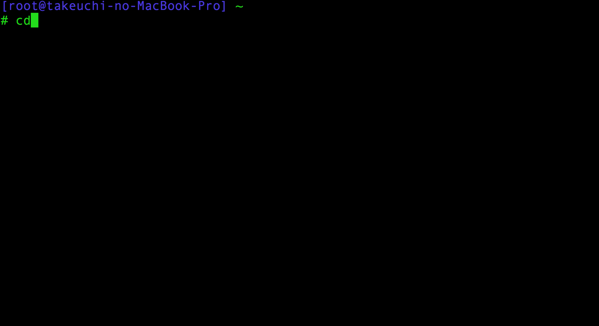

#suiage
suiage is simple commpress directory command in Go .

suiage makes .tar.gz files into /mnt .



#Installation

```
> cd $GOPATH/src

> git clone https://github.com/akms/suiage 

> go get github.com/akms/suiage/compress

> cd suiage

> go install
```

#Example

```
> suiage
/mnt/hostname/bin.tar.gz
/mnt/hostname/etc.tar.gz
/mnt/hostname/home.tar.gz
/mnt/hostname/lib.tar.gz
/mnt/hostname/lib64.tar.gz
/mnt/hostname/opt.tar.gz
/mnt/hostname/root.tar.gz
/mnt/hostname/sbin.tar.gz
/mnt/hostname/srv.tar.gz
/mnt/hostname/tmp.tar.gz
/mnt/hostname/usr.tar.gz
/mnt/hostname/var.tar.gz
```
